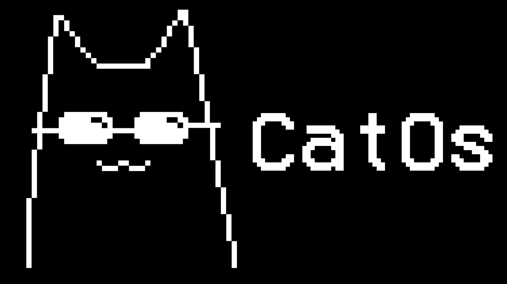
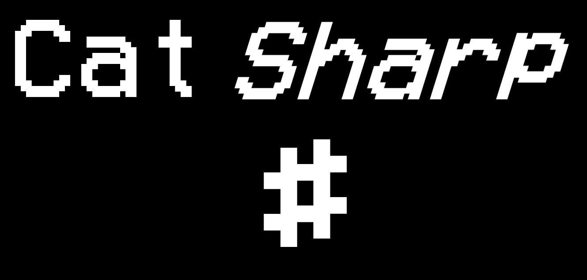
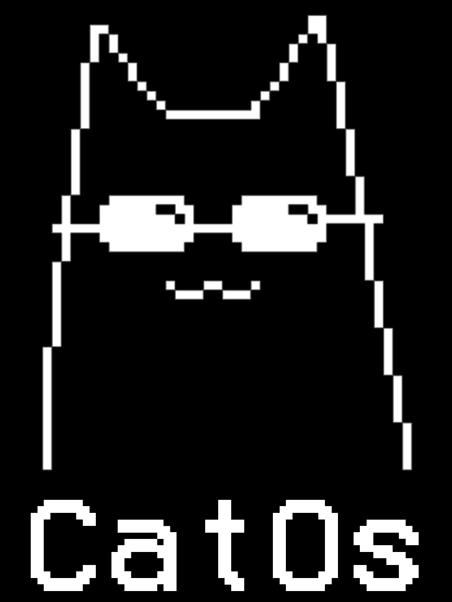

# CatOS



Прошивка для DIY мультитула на базе ESP32 с OLED-дисплеем. Включает игры, утилиты, магазин приложений и собственный скриптовый движок Cat# Engine.

## Особенности
- Игры: Дино, Пинг-Понг, Тамагочи (CatOsGotchi), Рулетка, Змейка
- Cat# Engine v1.0 - свой скриптовый язык для кастомных приложений
- [Магазин приложений](https://github.com/CatDevCode/CatOs-Apps) - скачивание .cat файлов прямо на устройство с GitHub
- Поддержка WiFi (STA и AP режимы). Загрузка/скачивание файлов на устройство через веб-интерфейс.
- Файловый менеджер для LittleFS
- Встроенный калькулятор
- Секундомер и таймер
- Будильник с настройкой даты и времени
- 2FA (TOTP)
- Air mouse через BLE с помощью гироскоп BMI160

## Сборки

Проект поддерживает несколько вариантов сборки под разное железо:

| Сборка | Плата | Особенности |
| --- | --- | --- |
| `catos_c3` | ESP32-C3-SUPERMINI | Lite-версия с RTC |
| `catos_s3` | ESP32-S3-Mini | Полная версия с RTC |
| `catos_spi` | ESP32 DevKit V1 | SPI-дисплей, без RTC |

В сборках с RTC есть часы, будильник и тамагочи.

## Управление
- **SPI-версия** - 5 кнопок: вверх, вниз, влево, вправо, ОК. SPI дисплей. Нет RTC.
- **Watch-версия** - 3 кнопки: левая, ОК, правая. I2C дисплей. Есть RTC.

## Cat# Engine



Собственный скриптовый движок для запуска .cat приложений прямо на устройстве.

Что можно делать:
- Переменные (int, float, string), условия `if/else`, циклы `while`
- Рисование на дисплее: линии, круги, прямоугольники, текст, пиксели
- Чтение кнопок (click, hold, down)
- Управление LED, доступ к времени/дате
- `random`, `delay`

Каждое приложение может иметь имя (`#name`) и иконку 24x24 (`#icon`).

Приложения также можно скачать из [магазина приложений](https://github.com/CatDevCode/CatOs-Apps). И добавить свои приложения в магазин.


## Установка
1. Установите [PlatformIO](https://platformio.org/)
```bash
pip install platformio
```
2. Клонируйте репозиторий:
```bash
git clone https://github.com/CatDevCode/CatOs-Watch.git
```
3. Перейдите в папку с проектом:
```bash
cd CatOs-Watch
```
4. Сбилдите проект (выберите нужную сборку, таблица выше):
```bash
pio run -e catos_s3
```
5. Загрузите на плату (выберите нужную сборку, таблица выше):
```bash
pio run -e catos_s3 --target upload
```

## Библиотеки
- [GyverOLED](https://github.com/GyverLibs/GyverOLED/) - OLED-дисплей
- [GyverDS3231](https://github.com/GyverLibs/GyverDS3231/) - RTC
- [GyverButton (старое, но работает отлично)](https://github.com/GyverLibs/GyverButton) - кнопки
- [GyverTimer (старое, но для совместимости)](https://github.com/GyverLibs/GyverTimer) - таймеры
- [Settings](https://github.com/GyverLibs/Settings) - веб-интерфейс
- [GyverDB](https://github.com/GyverLibs/GyverDB) - хранение настроек
- [Random16](https://github.com/GyverLibs/Random16) - рандом
- [MAX1704X](https://github.com/porrey/MAX1704X) - мониторинг батареи
- [NimBLE-Arduino](https://github.com/h2zero/NimBLE-Arduino) - BLE
- [ArduinoJson](https://github.com/bblanchon/ArduinoJson) - JSON парсинг
- [TOTP Library](https://github.com/lucadentella/TOTP-Arduino) - генерация TOTP-кодов
- DFRobot_BMI160 (в lib/, с фиксом) - гироскоп/акселерометр

> [!WARNING]
> При прошивке устройства убедитесь что выбрана правильная сборка под вашу плату.

## Кредиты
- Спасибо [Алексу Гайверу](https://github.com/GyverLibs/) за библиотеки
- Спасибо проекту [MicroReader](https://github.com/Nich1con/microReader/) за некоторые функции
- Спасибо [x4m](https://github.com/x4m) за калькулятор

## Проект открыт для Pull-реквестов
## Сделано с любовью


## By CatDevCode.
